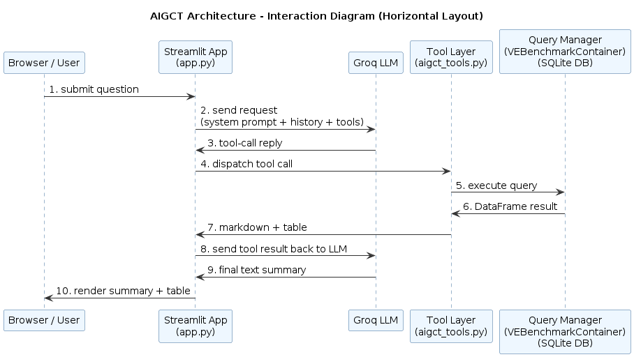

# AIGCT Web Architecture

## Overview

`aigctweb` is a Streamlit-based chat application that lets users ask natural language questions about benchmark performance of variant effect predictors (VEPs). The app routes each question through a Groq-hosted LLM using function/tool calls to query a local `aigct` benchmark database, then renders both a short assistant summary and a ranked results table.

## Architectural Components

- `Browser` / User Interface
  - Sends user questions via HTTP to the Streamlit app.
  - Displays chat history, assistant summary, and rendered tables.

- `Streamlit App` (`app.py`)
  - Serves the chat UI.
  - Holds cached resources: Groq client and `aigct` query manager.
  - Collects user input and session state.
  - Orchestrates the tool-use loop by calling `llm.run_turn()`.

- `Groq Client` (`llm.py`)
  - Wraps the Groq API client.
  - Maintains the system prompt and model configuration.
  - Sends conversation history and tool schemas to the model.
  - Receives assistant replies and tool call requests.

- `Tool Layer` (`aigct_tools.py`)
  - Defines tool schemas for function calling.
  - Dispatches two query tools:
    - `get_top_veps_for_task(task_code)`
    - `get_top_veps_for_task_gene(task_code, gene_symbol)`
  - Formats query results into pandas DataFrames and Markdown summaries.

- `aigct Benchmark Container` / `query_mgr`
  - Created from `VEBenchmarkContainer(CONFIG_PATH)` in `app.py`.
  - Provides database-backed query methods for benchmark performance.
  - Uses bundled metadata from `aigct.yaml` and `db/aigct.db`.

- `SQLite Benchmark Database` (`db/aigct.db`)
  - Stores the benchmark data used by the `aigct` query manager.
  - Read locally by the `VEBenchmarkContainer`.

## Message and Data Flow

1. User submits a question in the browser.
2. `Streamlit` app appends the question to session-state messages.
3. `app.py` calls `llm.run_turn(client, messages, query_mgr)`.
4. `llm.run_turn()` sends the full conversation to Groq with tool schemas:
   - system prompt
   - user turn history
   - candidate tool definitions
5. Groq returns one of three outcomes:
   - direct text reply (no tool call) → proceed to step 8
   - tool call request for `get_top_veps_for_task`
   - tool call request for `get_top_veps_for_task_gene`
6. If a tool call is returned:
   - `llm.run_turn()` records the assistant tool call in `messages`
   - `llm.run_turn()` dispatches the tool via `aigct_tools.dispatch()`
   - `dispatch()` executes the query against `query_mgr`
   - query result becomes a pandas DataFrame and markdown text
   - `messages` appends a tool response entry (in OpenAI message format)
   - **The loop continues: `llm.run_turn()` sends the updated messages (now including the tool result) back to Groq**
7. Groq processes the tool result and generates a final text summary:
   - Groq reads the markdown result and ranked table
   - Groq returns a final text response (no more tool calls)
   - `llm.run_turn()` records this final response in `messages`
8. `llm.run_turn()` returns the final assistant text and collected tables to `app.py`:
   - `app.py` renders the text summary to the chat
   - `app.py` renders the result DataFrame(s) as Streamlit dataframe widgets

## Object Interaction Diagram

The diagram above is a true PNG image showing the component flow and message exchanges between the browser, Streamlit app, Groq LLM, tool layer, query manager, and SQLite benchmark.

## Component Responsibilities

- `app.py`
  - UI layout and session state management.
  - Caching long-lived resources to avoid rebuilding the Groq client or database container repeatedly.
  - Error handling and final presentation of assistant replies and tables.

- `llm.py`
  - LLM orchestration and tool-call loop.
  - Converts Groq function-calling responses into structured assistant/tool messages.
  - Keeps the responsibilities of the model separate from the query logic.

- `aigct_tools.py`
  - Encodes the domain-specific tool API.
  - Maintains the official `TASK_CODE` vocabulary.
  - Converts raw query results into human-readable outputs.
  - Supports future extraction into a standalone MCP server.

- `db/aigct.db`
  - Provides the only persistent data source in the application.
  - Stored locally and committed for reproducible deployment.

## Deployment Notes

- The app uses the vendored `aigct` wheel from `vendor/aigct-1.0.1-py3-none-any.whl`.
- `requirements.txt` installs dependencies including Streamlit, Groq client, and the bundled `aigct` package.
- `app.py` is the Streamlit entry point and serves at `localhost:8501`.
- Local secrets are loaded from `.streamlit/secrets.toml`.

## Key Architectural Patterns

- Tool-oriented LLM interaction: the model is asked to call tools rather than answer directly.
- Cache resource reuse: `@st.cache_resource` keeps the Groq client and query manager in memory.
- Separation of concerns:
  - UI layer in `app.py`
  - LLM orchestration in `llm.py`
  - domain/tool layer in `aigct_tools.py`
  - data persistence in `db/aigct.db`

## Summary

This architecture centers on a Streamlit UI that mediates between user input and an LLM tool-use loop. The LLM decides which benchmark query to execute, the tool layer runs the query against a local SQLite-backed `aigct` container, and the app presents the results as both a concise assistant summary and a ranked DataFrame.
